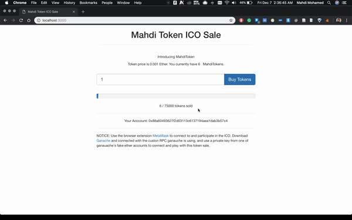

# MahdiToken
Token cryptocurrency built using an Ethereum smart contract following the [ERC20 Token Standard](https://theethereum.wiki/w/index.php/ERC20_Token_Standard) 

Motivations
------------------------------
Learn how Ethereum smart contracts work, and to build my own cryptocurrency and a ICO website for it.

Main files
------------------------------
The complete ERC20 Token contract is implemented in the file [mahdi.token/contracts/MahdiToken.sol](https://github.com/mvhdi/MahdiToken/blob/master/contracts/MahdiToken.sol), and the tests for this token are in the file [mahdi.token/test/MahdiToken.js](https://github.com/mvhdi/MahdiToken/blob/master/test/MahdiToken.js).

The complete Token sale contract is implemented in the file [mahdi.token/contracts/MahdiTokenSale.sol](https://github.com/mvhdi/MahdiToken/blob/master/contracts/MahdiTokenSale.sol) , and the tests for this token sale contract are in the file [mahdi.token/test/MahdiTokenSale.js](https://github.com/mvhdi/MahdiToken/blob/master/test/MahdiTokenSale.js)

Client side is is implemented in the file [mahdi.token/src/app.js] (https://github.com/mvhdi/MahdiToken/blob/master/src/js/app.js), which uses web3.js to allow you to buy tokens using metamask.

Site
------------------------------
In the next release I'll host the ICO website on github pages (https://github.com/mahditoken/MahdiToken), and set it up so you can buy MahdiTokens  using MetaMask's Rinkeby Test network. You'll be able to see the transactions on the Ethereum blockchain using the site https://etherscan.io/. Once this is up and running you will not need to run MahdiToken on your local machine.

Running MahdiToken on your local machine
------------------------------

https://github.com/mvhdi/MahdiToken/network/dependencies
### Prerequisites
1. install node.js  `brew install node`
2. install truffle framework from (truffleframework.com) or ` npm install -g truffle`
3. install Ganache for mac os from https://truffleframework.com/ganache
4. install Google Chrome
5. install the Metamask chrome extension from https://metamask.io/
6. install web3.js `npm install web3`
7. If you are using the Sublime text editor, and want syntax highlighting for the Solidity language download here https://packagecontrol.io/packages/Ethereum
8. install liteserver `npm install lite-server`

Getting Set Up
------------------------------

1. Fork this repository on GitHub.
2. Clone *your forked repository* 
3. `cd MahdiToken`
4. Startup the Ganache application on you computer
5. run `truffle migrate --reset `
6. run `truffle compile`
7. run `truffle migrate`
8. run `truffle test` all tests should pass

Running the MahdiToken Sale
------------------------------

9. Copy the rcp server number Ganache is running for example mine was HTTP://127.0.0.1:7545
10. Launch the Metamask Chrome extension, click on the network button, and then click custom rpc
11. Click on setting and scroll down to the New Network option and input the server Ganache is running for example HTTP://127.0.0.1:7545.
12. Click on the account icon, and then click on Import Account.
13. Select private key, and then go into Ganache and click on the key icon for one of the addresses, and then copy and paste that key into the metamask private key box.
14. Rename that account to Ganache 1.
15. Repeat steps 12-13 using the private key from another address, and name that account Ganache2.

Transfering  MahdiTokens to the token sale contracts
------------------------------
16. `cd MahdiToken`
17. `truffle console`
* deploy token sale contract
18. `MahdiTokenSale.deployed().then(function(i){tokenSale=i;})`
* see the output undefined 
19. ` tokenSale`
* deploy token
20. ` MahdiToken.deployed().then(function(i) {token=i;})`
21. `token`
* move MahdiTokens from the MahdiToken contract to the MahdiTokenSale contract
* first set the number of MahdiTokens that are available which are 750000
22. `$ tokensAvailable = 750000`
* get the admin account (which we transfer the tokens from for the sale)
23. `admin = web3.eth.accounts[0]`
* should see the admin account number which is the ganache account
* transfer the tokens from the admin account
24. `token.transfer(tokenSale.address, tokensAvailable, {from: admin}) 
* check the account, output should be:  BigNumber { s: 1, e: 5, c: [ 750000 ] }
25. `token.balanceOf(tokenSale.address)`
* go to the token sale site 
26. `npm run dev`
27. Switch to the account Ganache 1, it should say you have 250000 MahdiTokens total is a million tokens, and 750k were provisoned for the token sale.
* now switch to the account Ganache 2 on metamask, and click on the button to buy some MahdiTokens
* if you get an unknown address issue just refresh the browser, also when you purchase refresh browser to see updated information.

More Info
------------------------------
[Writing tests for Solidity](https://truffleframework.com/docs/truffle/testing/writing-tests-in-javascript)

[Examples of ERC20 tokens](https://eidoo.io/erc20-tokens-list/)

